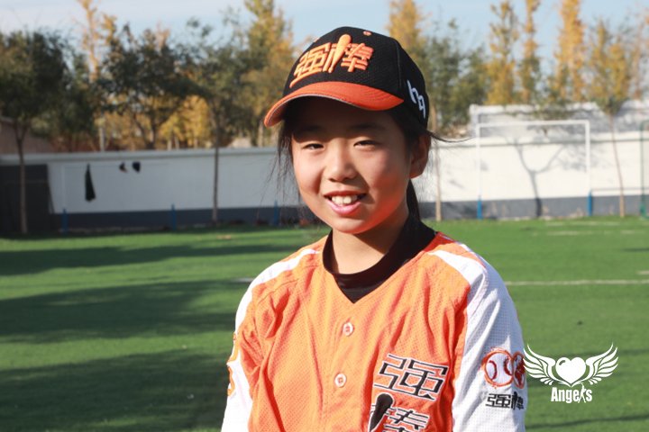
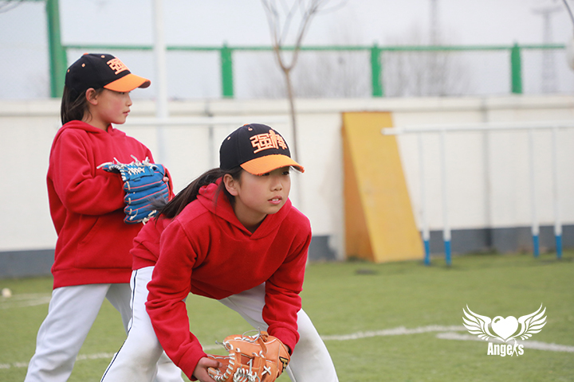
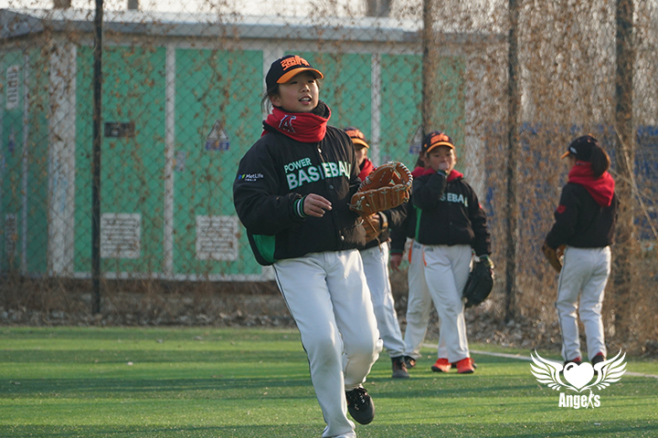

>各位姐姐哥哥们好，很高兴认识大家，请浏览内容来认识我吧~

---

⚾⚾⚾⚾⚾⚾⚾⚾⚾⚾⚾⚾⚾⚾**浏览开始啦**⚾⚾⚾⚾⚾⚾⚾⚾⚾⚾⚾⚾⚾⚾

## 基础信息
**姓名**：柴雨婷

**出生日期**：2010年11月23日

**兴趣爱好**：跳皮筋、沙包

**More**：更多关于我的资料信息，等待你来探索哦。

## 初识印象

-  雨婷是一个很在意别人感受的女孩，在画画的时候会一直问我这个颜色好看吗？那个颜色可以吗？看到我的手机壳觉得很可爱的时候，也不好意思说想玩，在我说“你可以拿去玩一会”的时候，她眼里是盖不住的惊喜。

-  这里的小女孩都喜欢玩跳皮筋，雨婷也不例外，主动教我和字节的同学想让我俩一起玩，可惜我们两个大朋友肢体协调能力远远不如女孩们，试了很多次，雨婷一直很有耐心。

## 小记小问

>Q:每天的棒球训练时长是多久？
>
>A:如果练得顺利的话会快些，有时候动作一直学不好，就会多练一会。
>
>Q:在棒球基地的一天是如何度过的，每天做喜欢做的事情？
>
>A:周一到周五的话，一般早上6点就要起来，早上一般会有文化课，中午午休后开始训练，一般训练到四五点就会结束。
>
>Q:棒球学习过程中遇到过什么困难或问题？是如何克服这些问题的？
>
>A:会碰到教练要求的动作自己试了很多次都做不到，就感觉特别丧气。
>
>Q:棒球比赛中获得的荣誉，印象最深刻的瞬间？
>
>A:在这之前只参过小比赛，拿过团体的奖。（不好意思地笑）
>
>Q:棒球学习或比赛遇到的挫折及问题，是如何克服它们的？
>
>A:一直试。
>
>Q:你的愿望是什么？
>
>A:想等自己变厉害去参加比赛。
>
>Q:如果没有棒球，你觉得你的人生是什么样子
>
>A:其实一时也说不出来。
>
>

⚾⚾⚾⚾⚾⚾⚾⚾⚾⚾⚾⚾⚾⚾**浏览结束啦**⚾⚾⚾⚾⚾⚾⚾⚾⚾⚾⚾⚾⚾⚾

---
