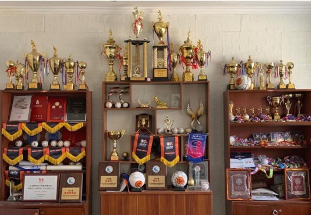

>强棒基地由前国家棒球队队长孙岭峰与爱心人士联合筹资建设、创建的中国第一支公益棒球队。主要资助对象为全国范围内 7-10 岁困境儿童，通过专业的棒球技能获得职业发展方向和未来的就业机会。

⚾⚾⚾⚾⚾⚾⚾⚾⚾⚾⚾⚾⚾⚾⚾⚾⚾⚾⚾⚾⚾⚾⚾⚾⚾⚾⚾⚾⚾⚾

## 项目起源

>棒球是世界最受欢迎的体育运动之一，棒球运动强身益智、崇尚礼仪，是家庭化、团队化的体育项目。每年全球有超过 20 亿的观众观看棒球赛事。
棒球世界排名前四的是日本，美国，韩国，中国台湾，所以棒球也是最适合亚洲人的体育运动。目前，中国棒球在世界排名约 20 左右，仍处于起步阶段，具有很大的上升空间，并且在一二线城市已经逐渐被大家所认可。
随着棒球产业的不断发展，棒球人才的需求量将越来越大，棒球人才的未来机遇也将前所未有。项目主要发起人孙岭峰：从 7 岁跟随“国宝级”教练张锦新学习棒球，与棒球相伴 30 余载。
曾任国家棒球队队长 15 年，连续三届亚洲盗垒王，国家队第一棒、当家中外野手。棒球是他的生命。他的成长经历证明了棒球可以改变人生。中国队长的梦想，用棒球给困境中的孩子一个重新选择未来的机会。
有一天，他将带着这些孩子一起，让中国棒球得到世界的尊重。

---

## 项目意义
>“强棒天使项目”紧跟国家“精准扶贫”的公益战略方针，针对 7-9 岁贫困儿童进行全面帮扶。经过多年的专业和系统的棒球训练，完成对孩子未来的职业规划，让这些儿童能够有一技之长，得到全面的素质培养。另
一方面为中国棒球产业的发展储备并输送大量的人才。“授人以鱼不如授人以渔”，强棒天使项目通过长期投入的方式，培养孩子棒球职业能力，在解决基本生活的同时，塑造他们健全、独立的品格，帮助他们实现更高层次的人生目标。

---

## 获得荣誉
>

---

## 项目期望
我们期望“强棒天使”可以让更多的困境儿童获得改变一生的机会，通过棒球这项体育运动成为国家的有用之材，为自己，为家乡，为社会，为国家做出应有的贡献，并赢得荣誉及尊重！

>以上内容均来源于强棒项目官方内容，想要了解更多内容欢迎关注官方账号

⚾⚾⚾⚾⚾⚾⚾⚾⚾⚾⚾⚾⚾⚾⚾⚾⚾⚾⚾⚾⚾⚾⚾⚾⚾⚾⚾⚾⚾⚾

---
